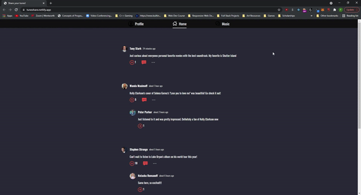
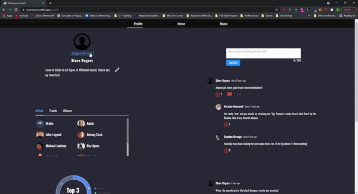
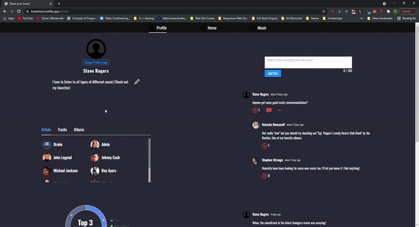
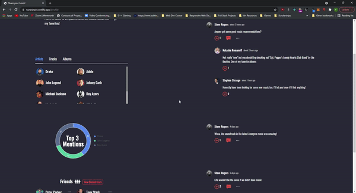
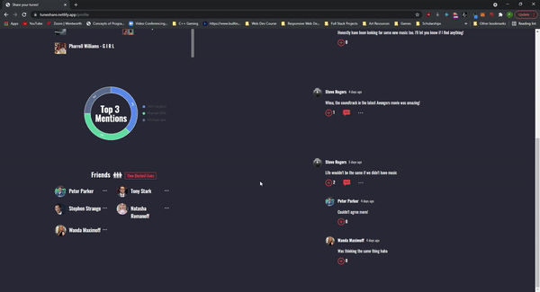
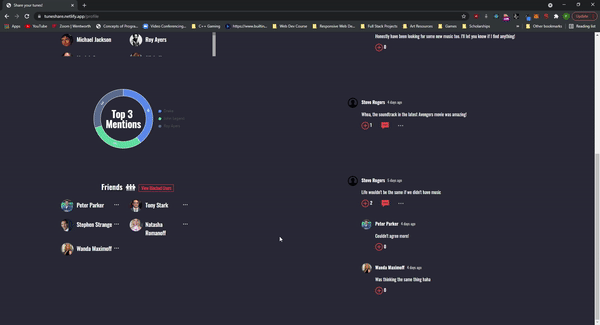
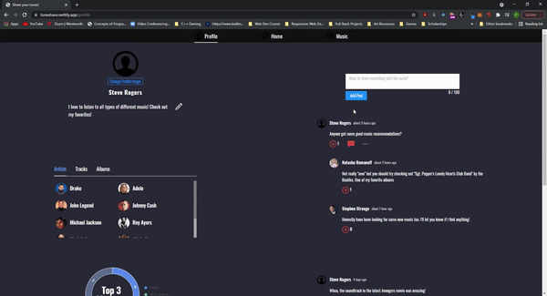
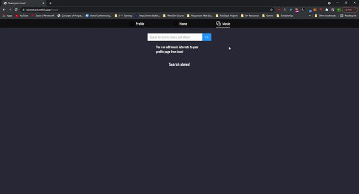
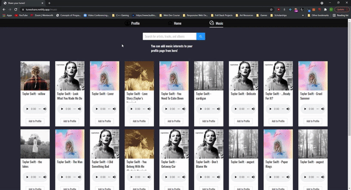

# Tune Share

This is a music focused Social Media site that functions as a single page application. Features includes...
    Searchable artists, tracks, and albums that can be added to user's profile page
    Posting/Commenting system
    Friend system

[https://tuneshare.netlify.app/](Live Website Link)

## Home Page

Posts from other user's visible
Can like post/comments and make comment
Block user directly in more options menu

## Profile Page

Displays info about the user

### User Info

User's name and editable bio

User's editable profile picture (GIF doesn't show image file actually being chosen)

### Music Interests

List of removable favorite artists, tracks, and albums. 
Displays top 3 music interests in pie chart that updates automatically

### Friends

Removable friends

Block/Unblock system

### Profile Posts

User can add a post

Profile owner can remove their own posts

## Music Page

Can search for artists, tracks, albums in search bar

User can add their specified music interest to their profile page

